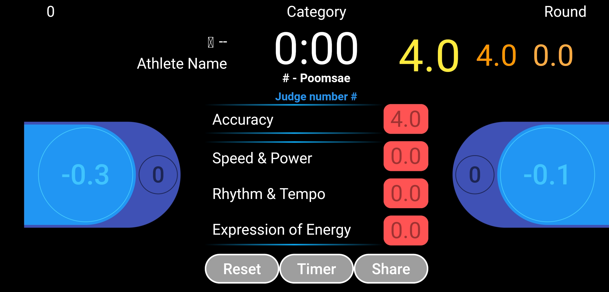

## scoring_flutter

An one weekend rush android Scoring application for Taekwondo Poomsae. While the connectio mode is not finished, it has an offline mode where you can share the scores.

## Build

# Pre-requisites

Building/Editing requires (newer versions may require the appropriate fixes to be built):

- Android Studio 3.5 [download](https://redirector.gvt1.com/edgedl/android/studio/install/3.5.0.21/android-studio-ide-191.5791312-windows.exe)
- Flutter 1.12 [download](https://storage.googleapis.com/flutter_infra_release/releases/stable/windows/flutter_windows_v1.12.13+hotfix.5-stable.zip)

# Build commands

Inside the project directory run:

> flutter pub get

> flutter build apk

the APK will be built to `build\app\outputs\apk`